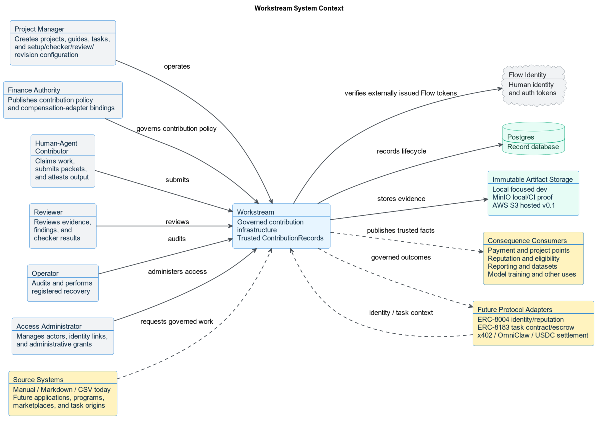
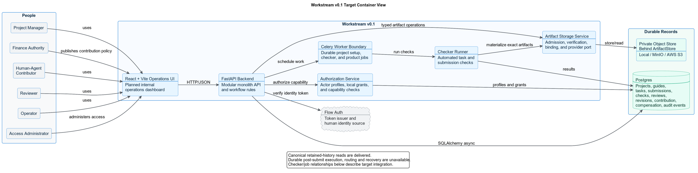
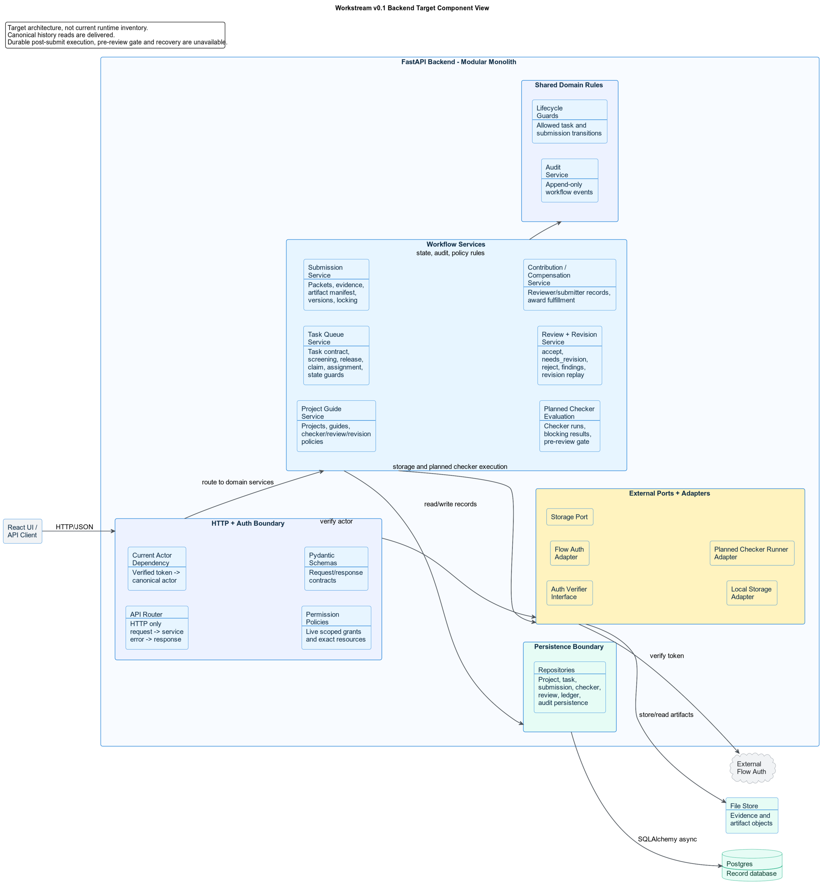
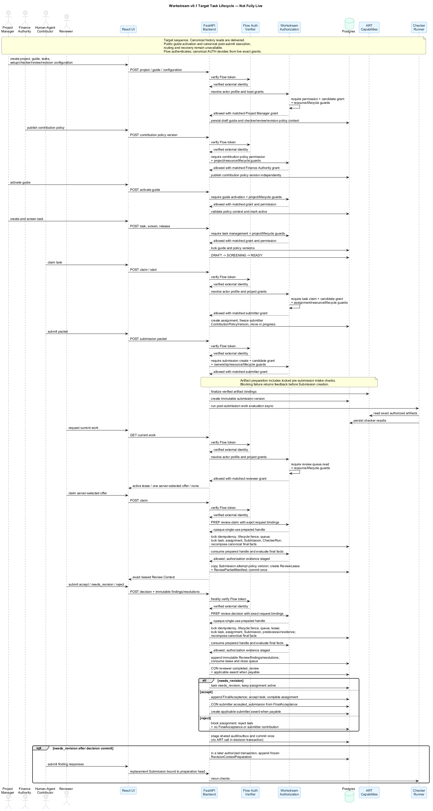
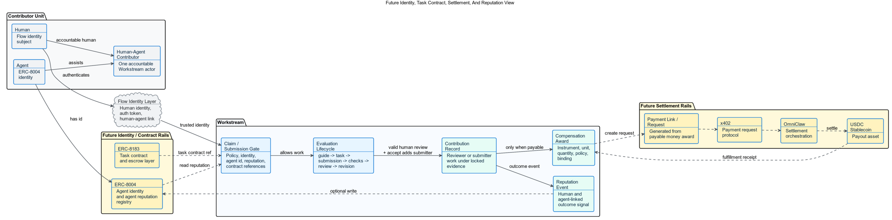

<section class="cover">

# Workstream Architecture Brief

<div class="line"></div>

<p class="subtitle">Governed contribution infrastructure for human and AI work</p>

Workstream turns project-defined tasks, immutable submissions, policy-governed
checks, and policy-governed acceptance into trusted `ContributionRecord` facts. It
records who completed what, under which locked rules, using which exact
artifact, and with what verified outcome.

<p class="meta">Scope: bounded v0.1 delivery, with future adapter context for identity, task contracts, settlement, and reputation.</p>

</section>

<div class="page-break"></div>

## Executive Summary

Workstream is the governed lifecycle core between systems that request work and
systems that consume its outcome. It does not need to own the source
application, execution environment, identity provider, or downstream economic
system. It gives every project versioned rules, every task a locked policy
context, every Submission immutable artifact lineage, every valid human
decision an attributable Review and reviewer contribution, and every accepted
task an immutable FinalAcceptance before the submitter contribution.

The diagrams depict target architecture, not a fully connected live lifecycle.
Canonical retained submission/checker history is delivered. Post-submit execution,
routing and recovery are unavailable; their removed execution and repair paths are
not alternatives. The lifecycle sequence depicts the planned human-review branch. The versioned `human_review_required` defaults true in the existing locked
ReviewPolicy; false uses an authorized automated acceptance source and shared
CON participant without a reviewer contribution. That runtime remains pending,
not enabled by checker success alone. The [product-builder handoff](../../.commitrail/changes/pre-review-plan-reconciliation.md#product-builder-handoff-implement-the-setting-next)
describes the delivered setting; the PDF and source present the same current boundary.

v0.1 is focused on proving the internal lifecycle:

```text
Project Guide -> Task Queue -> Pre-Submission Intake -> Immutable Submission
-> Post-Submission Work Evaluation -> Review
-> Revision / FinalAcceptance / Rejection -> Contribution Record
-> Compensation Award / Fulfillment -> deferred reputation projection
```

Pre-submission intake checks package fitness, completeness, integrity, and
configured intake quality before Submission creation. Post-submission evaluation
checks the immutable work against locked task/project requirements and produces
durable review-eligibility evidence. Passing intake is not proof of task success;
neither stage replaces required human Review or independently authorizes
acceptance on the planned automated branch.

The stages are not a blanket guarantee of deterministic execution. Deterministic
rules and supported model/agent evaluators are distinct methods; deterministic
policy compilation does not guarantee repeatable model judgments. Only supported
registered implementations execute. The setup agent proposes policies, not
runtime judgments, and no live agent judge is claimed by this brief. The
[roadmap](../roadmap_status.md) owns current implementation status.

<div class="callout">
Current v0.1 is backend-first and internal-loop-first. External source adapters, agent identity writes, task escrow, x402 payment requests, OmniClaw settlement, USDC payouts, public marketplace flows, and automated routing remain adapter boundaries until the internal evaluation loop works with real tasks.
</div>

## Architecture Principles

| Principle | Meaning |
| --- | --- |
| Source-agnostic, manual-first | v0.1 accepts manual, markdown, or CSV-controlled intake. Future origins normalize into the same task contract. |
| Identity is not authority | Flow Identity is the current v0.1 authentication provider. Local grants and lifecycle guards decide Workstream authority. |
| Trusted contribution facts | Exact artifact, locked policy, checker, Review, and actor lineage produce immutable `ContributionRecord` facts for downstream consumers. |
| Modular monolith | FastAPI remains one deployable backend while keeping routers, services, repositories, ports, and adapters separate. |
| Postgres record database | Local, CI, and production-like development use Postgres as the record database. |
| Object-storage abstraction | Local filesystem storage is allowed only behind the provider-neutral `ArtifactStore`; AWS S3 is the v0.1 hosted provider and MinIO is the local/CI protocol proof. |
| Async-first execution | Long-running checker work does not block request/response paths. |
| Contribution before compensation | Every valid human Review creates a reviewer contribution. FinalAcceptance is created only for accept and is the sole source of the submitter contribution. Compensation may attach afterward; reputation is deferred. |

<div class="page-break"></div>

## C1: System Context

The context diagram shows Workstream between source systems and consequence
consumers. Workstream owns governed lifecycle truth. It does not own primary
identity, work execution, external task origins, settlement rails, reputation
systems, or other uses of the resulting contribution facts.

<div class="diagram">
  
</div>

### What This Means

- Project managers, contributors, reviewers, operators, Finance
  Authorities, Access Administrators, and Audit Authorities interact with
  Workstream through their independent grants.
- Adjudicator grants and adjudication are excluded from v0.1.
- Flow Identity is the current v0.1 human identity and authentication source,
  not the definition or ownership boundary of Workstream.
- Postgres is the record database.
- Storage sits behind an object-storage abstraction.
- Source applications and future protocol rails connect through adapters.
- Payment, points, reputation, reporting, datasets, and model-training systems
  consume Workstream facts without creating or rewriting them.

<div class="page-break"></div>

<section class="landscape">

## C2: v0.1 Container View

The container view shows the bounded v0.1 target architecture. It is intentionally
small: React + Vite for the planned internal operations UI, FastAPI for the
backend, Postgres for records, a storage interface for artifacts, and an async
checker/job boundary.

<div class="diagram wide">
  
</div>

</section>

### Container Responsibilities

| Container | Responsibility |
| --- | --- |
| React + Vite operations UI | Planned internal operations dashboard for project, task, submission, review, and compensation fulfillment workflows. Reputation UI remains deferred. |
| FastAPI backend | API contracts, workflow rules, auth dependency, lifecycle guards, module orchestration, and audit writes. |
| Celery worker boundary | Durable project setup and registered background jobs; checker execution is a target boundary. FastAPI background tasks are not the Workstream product-job boundary. |
| CHECKERS | Delivered retained-history reads; durable post-submit execution, routing and recovery remain unavailable. |
| Storage interface | Keeps file/evidence semantics stable while local storage and the hosted AWS S3 profile implement the same provider-neutral port. |
| Postgres | Durable record database for the full Workstream lifecycle. |

<div class="page-break"></div>

## C3: Backend Component View

The backend component view zooms into the FastAPI container. It shows how the modular monolith stays clean without becoming a distributed system too early.

<div class="diagram">
  
</div>

<div class="page-break"></div>

### Backend Boundaries

| Boundary | Responsibility |
| --- | --- |
| HTTP + AUTH boundary | Flow verifies authentication; canonical AUTH owns decisions using live exact grants and server-loaded facts. The caller transaction atomically commits effects and AUTH evidence. |
| Workflow services | Project guide, task queue, submission, checker, review/revision, and contribution/compensation services own business rules; reputation remains deferred. |
| Shared domain rules | Lifecycle guards and audit writes stay shared instead of being scattered through routers. |
| Persistence boundary | Repositories own SQLAlchemy async persistence and Postgres access. |
| External ports/adapters | Flow auth, storage, and checker execution stay behind interfaces. |

<div class="page-break"></div>

## Lifecycle Sequence

The sequence below shows the target v0.1 loop. Public guide activation and canonical
post-submit execution/recovery remain pending. Retained history does not execute
checkers or authorize acceptance.

<div class="diagram sequence">
  
</div>

### Lifecycle Invariants

- A task cannot enter `READY` until it has locked the complete, binding-valid
  ContributionPolicyVersion bound during guide activation. TaskAssignment
  copies that task lock, Submission stamps the exact attempt version, and
  ReviewLease copies the Submission stamp without claim-time selection. A
  version retired after it was validly locked remains authoritative for that
  immutable attempt.
- A contributor submission creates a new immutable submission version; locked artifacts are not edited in place.
- Review decisions are exactly `accept`, `needs_revision`, or `reject`.
- `needs_revision` preserves immutable findings, responses, preparations, and
  later resolutions.
- Every valid human Review creates a reviewer contribution; accept additionally
  creates FinalAcceptance, which alone sources the submitter contribution.
- Compensation fulfillment status is separate from task acceptance.

<div class="page-break"></div>

<section class="landscape">

## Future Identity, Task Contract, Settlement, And Reputation

This view explains the broader architecture direction without moving it into v0.1 scope.

<div class="diagram wide">
  
</div>

</section>

### Future Separation Of Concern

| Concern | Owner |
| --- | --- |
| Current v0.1 human identity and auth | Flow Identity adapter |
| Agent identity | ERC-8004 |
| Agent reputation read/write | ERC-8004 through a future Workstream adapter |
| Task contract and escrow reference | ERC-8183 |
| Governed task, artifact, check, review, and revision lifecycle | Workstream |
| Reviewer and accepted-submitter contribution facts | Workstream `ContributionRecord` |
| Contribution policy, immutable award, and fulfillment status | Workstream compensation records |
| Payment request and settlement execution | x402, OmniClaw, and USDC settlement rails |

<div class="boundary">
Future ERC-8004, ERC-8183, x402, OmniClaw, and USDC integrations do not replace
Workstream. They use Workstream records. Source and consequence systems cannot
create or revise Workstream identity, authority, submission, Review, or
contribution truth.
</div>

<div class="page-break"></div>

## Scope Boundary

### Current v0.1 Boundary

- project guide and versioned policy context
- task queue and task records
- assignment and claim flow
- submission packets and evidence
- checker framework and pre-review gate
- human review and revision replay
- contribution records
- compensation award, receipt, and fulfillment projection records
- contribution evidence for a future reputation projection
- audit events

### Later Adapter Boundaries

- external origin onboarding and source adapters
- automated routing
- owner-agent execution workspace
- ERC-8004 agent identity and reputation writes
- ERC-8183 task contract and escrow settlement
- x402 payment requests
- OmniClaw settlement orchestration
- USDC payout execution
- marketplace discovery
- adjudication lifecycle, actions, queues, leases, and decisions

## Closing

Workstream v0.1 succeeds when it can run real internal work from project guide
to reviewer/submitter contributions with evidence, checks, immutable human
review, revision discipline, FinalAcceptance, conditional compensation awards,
and fulfillment status. The active review contract is
`docs/spec_review_lifecycle.md`; its surfaces remain unavailable until REV-13.

The system should expand only after that loop is proven.

The complete product remains source-agnostic: once the governed core is proven,
centralized, sovereign, federated, and permissionless applications can consume
the same trusted contribution facts through explicit adapters.
