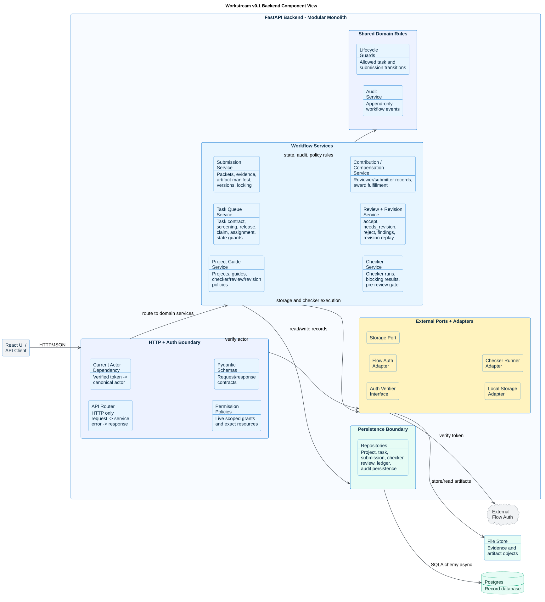

# Workstream v0.1 Backend Target Component View

This is the target component view for the FastAPI modular monolith, not an
inventory of delivered runtime components. Canonical authorized submission and
checker history reads are implemented. Durable post-submit execution, the
pre-review gate and checker recovery are planned and unavailable; the obsolete
checker service and Celery worker have been removed. See the
[current capability ledger](../roadmap_status.md) for delivery status.

The backend stays one deployable service while keeping module boundaries strict. Routers handle HTTP, services own workflow rules, repositories own database access, schemas own API contracts, and adapters own external boundaries.



Source: [backend_v01_components.puml](backend_v01_components.puml)

## Component Contract

| Boundary | Rule |
| --- | --- |
| Routers | HTTP only: parse request, resolve actor/session, call services, map domain errors. |
| Services | Business rules: status transitions, policy locks, authorization decisions, audit intent. |
| Repositories | SQLAlchemy 2.x async persistence only; no HTTP or auth decisions. |
| Schemas | Pydantic input/output contracts and API validation. |
| Auth adapter | Returns verified external token identity; canonical ACTORS admission and AUTH grants provide authorization context. |
| Storage port | Hides local filesystem, MinIO, and AWS S3 behind stable provider-neutral artifact references. |
| Audit module | Writes append-only evidence for state changes and sensitive workflow events. |

## Target Lifecycle Order

The v0.1 backend follows the Workstream product lifecycle in this dependency
order:

```text
Projects and guides
-> tasks and assignment
-> submission packets and evidence
-> checker runs
-> review and revision
-> reviewer contribution for every valid Review
-> FinalAcceptance on accept only
-> submitter contribution sourced only from FinalAcceptance
-> conditional compensation award and fulfillment status
```

Reputation remains a future separate consumer and is not written by the v0.1
review lifecycle.
