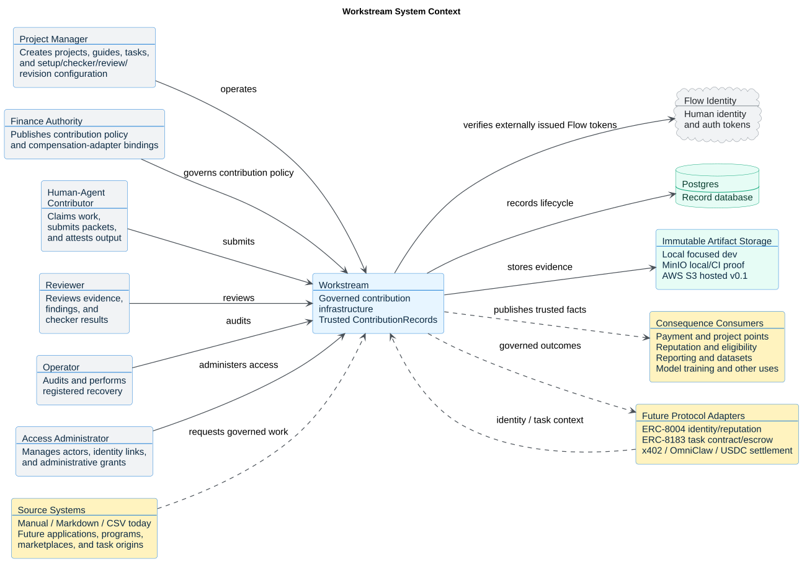

# Workstream System Context

This C4-PlantUML context view shows Workstream as the governed contribution core
between systems that request work and systems that consume trusted contribution
facts.

The diagram intentionally separates current v0.1 scope from future adapter
boundaries. Workstream owns project-rule context, task and submission lineage,
checks, authorized review, revision history, contribution records, and its
conditional compensation records. It does not own source applications,
execution tools, primary identity, settlement rails, or downstream consequence
systems.

Source: [workstream_context.puml](workstream_context.puml)

## Context Rules

- Source systems may request work through current or future intake adapters, but
  all admitted tasks normalize into the same governed contract.
- Flow Identity is the current v0.1 human identity and authentication provider.
- Workstream verifies Flow-issued tokens; it does not own login, signup,
  password reset, password storage, or primary auth sessions. Verified identity
  alone is not Workstream authority.
- Workstream treats a working contributor as a human-agent unit for workflow purposes, while preserving separate human and agent references when agent identity is introduced.
- ERC-8004 is the future agent identity and agent reputation rail.
- ERC-8183 is the future task contract and escrow rail.
- Payment, points, reputation, reporting, dataset, and model-training systems
  consume trusted contribution facts without creating or rewriting them.
- x402, OmniClaw, and USDC settlement are future payment execution rails.
- v0.1 stays focused on the internal project guide -> task -> submission ->
  checks -> review -> revision -> contribution/compensation loop, preserving
  evidence for a future reputation projection.
